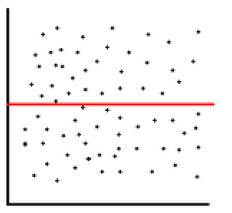
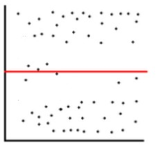
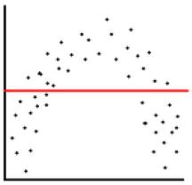
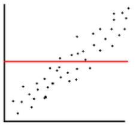
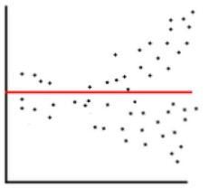

# Ergänzungen Einheit 14 (WP13/14)

Im folgenden Abschnitt werden einige Punkte erläutert, die Teil der letzten Einheit des Seminars waren beziehungsweise Teil des WP13/14 (da die 12.Sitzung und damit der WP12 ausgefallen ist). Wir möchten nochmals auf die multiple, lineare Regression und das bereits eingeführte Modell eingehen. Über einen gemeinsam geteilten Datensatz sollen die Interpretation dieser Regressionsmodelle im Detail besprochen werden. Das bietet auch die Möglichkeit, das R-eigene Dateiformat zum Speichern von Datensätzen zu verwenden. Neben der Repetition der Interpretation gilt es weiter über eine grafische Residuenanalyse die Anwendungsvoraussetzungen für die multiple lineare Regression zu testen.

Das heisst wir widmen uns folgenden Lernziele:

* Sie können multiple lineare Regressionsanalysen in R korrekt modellieren, durchführen und interpretieren.
* Sie verstehen, wie die Anwendung von `plot()` auf unser Ergebnisobjekt bei der Analyse der Qualität und Aussagekraft eines Regressionsmodells helfen kann.
* Sie können Ausreisser in einem Regressionsmodell ausschliessen und die damit erreichten Veränderungen im Modell einschätzen.

...und ergänzen diese um folgenden Aspekt:

* Sie haben eine Möglichkeit kennengerlernt, wie wir in einem R-eigenen Dateiformat Datensätze abspeichern und aufrufen können.


## Dateiformat RDS

Das Speichern eines einzelnen Objektes in einem R-eigenen Dateiformat ist möglich mittels `saveRDS()`.^[Mittels der Funktion `save()` können weiter mehrere Objekte/eine ganze Environment abgespeichert werden. Beim Laden behalten dann allerdings der Name der Objekte nicht geändert werden] Das Einlesen der gespeicherten Datei erfolgt dann wieder über `readRDS()`.
```{r eval=FALSE}
?saveRDS()
?readRDS()
```

*saveRDS and readRDS provide the means to save a single R object to a connection (typically a file) and to restore the object, quite possibly under a different name.*

Damit ist die Möglichkeit gegeben, die Bearbeitung eines Datensatz (das Löschen von unötigen Fällen und Fehlern, Umkodieren, Definieren von Faktoren, usw.) nicht als Code zu sichern, sondern eben als ein Datei selber, die den Datensatz enthält. Wir können daher in unserem Import Skrit die Funktionen zur Zufallsauswahl von 200 Fällen löschen und dann eben einen `saveDRS()`-Befehl ergänzen. Die so erstelle Datei landet dann natürlich in unserem definierten Arbeitsverzeichnis:
```{r eval=FALSE}
# Laden der Daten
setwd("C:/Users/SchweglG/R_Daten/06_HS21/R_Seminar-HS21")
daten_ess <- read.csv(file = "Daten/ESS1-8e01.csv")

# nicht benoetigte Variablen loeschen
daten_ess$x <- NULL

# Definieren von fehlenden Werten
daten_ess$yrbrn[daten_ess$yrbrn==7777 |
                  daten_ess$yrbrn==8888 |
                  daten_ess$yrbrn==9999] <- NA ## usw... 

# Fehler in den Faellen korrigieren
## Fall 132
daten_ess$agea[132] <- 2016 - daten_ess$yrbrn[132] ## usw... 

# Faktoren definieren
daten_ess$gndr <- factor(daten_ess$gndr, 
                         levels = c(1,2),
                         labels = c("Male", "Female")) ## usw... 

## geordnete Faktoren
daten_ess$polintr <- factor(daten_ess$polintr, 
                            levels = c(4,3,2,1),
                            labels = c("Not at all interested", 
                                       "Hardly interested", 
                                       "Quite interested", 
                                       "Very interested"), ## usw... 

saveRDS(file = "daten_ess_E14.rds")
```

Was bietet diese Variante zum Umgang mit Datensätzen für Vorteile? Dies ermöglicht eine Kontrolle und einen etwas vereinfachten Umgang mit aufbereiteten Datensätzen, der auch optimiert ist für R (im Gegensatz etwa zu SPSS oder STATA Dateien). Im Seminar erläuterte Josias Bruderer zwei weitere Aspekte: Erstens erfolgt nur eine Lese- und keine Rechenoperation, was eben zu mehr Geschwindigkeit führt. Zweitens benötigt einE jeweiligeR BenutzerIn nicht all die Pakete, die wir womögilch zur Aufbereitung eines Datensatzes verwendet haben. 

Was ist ein Nachteil im Umgang mit diesem Dateiformat? Mit dieser Vorgehensweise verlieren wir wiederum etwas Transparenz. Wir kreiieren uns hier eine Blackbox -- und damit etwas, was wir bisher immer versucht haben zu umgehen.

```{r include=FALSE}
daten_ess_f <- readRDS(file = "Daten/daten_ess_E14.rds")
```

```{r eval=FALSE}
setwd("C:/Users/SchweglG/R_Daten/06_HS21/R_Seminar-HS21")
daten_ess_f <- readRDS(file = "daten_ess_E14.rds")
```


## Relevanz von Stichprobengrösse

Bereits im Rahmen des WP11 haben wir uns der Korrelationstabelle gewidmet. Hier soll zuerst ergänzend noch eine etwas andere Variante präsentiert werden, wie wir die Tabelle mittels der Funktion `attach()` erstellen können und so direkt eine Beschriftungen erhalten. Anschliessend können wir die Werte wiederum kurz interpretieren.
```{r}
library(Hmisc)

attach(daten_ess_f)

rcorr(cbind(wkhtot,
            agea,
            edulvla,
            chldhm),
            type = "pearson")
detach(daten_ess_f)
```

Welche Korrelationenswerte sehen wir (deskripitv)?  
-kleine positive Korrelationen zwischen "wkhtot" und "edulvla" sowie zwischen "wkhtot" und "chldhm"    
-sehr kleine negative Korrelation zwischen "edulvla" und "chldhm"    
-sehr kleiner Korrelationswert zwischen "zwischen "chldhm" und "agea"  
-kaum vorhandene Korrlation zwischen "edulvla" und "agea" sowie "wkhtot" und "agea"

Trotz der geringen Korrelationswerte sehen wir aber, dass ausser zwei alle Zusammenhänge auch auf die Grundgesamtheit übertragbar sind (lediglich "edulvla" und "agea" sowie "wkhtot" und "agea" sind nicht signfikant). Zum Vergleich: Als wir mit einem 200er Datensatz gearbeitet haben waren diese Werte noch nicht signifikant.
```{r}
source(file = "Daten/ess_import.R")
attach(daten_ess)
rcorr(cbind(wkhtot,
            agea,
            edulvla,
            chldhm),
            type = "pearson")
detach(daten_ess)
```

Da statistische Signifkanz stark von der Stichprobengrösse abhängig ist, sollte sie nicht überbewertet werden. Wichtig ist die verschiedenen Kennzahlen miteinander zu betrachte: die deskriptiven Werte, die Standardfehler, die p-Werte (Signifikanz) und die Stichprobengrösse.


## Übung zur multiplen, linearen Regression

Anschliessend können wir das multiple, lineare Regressionsmodell nochmals erstellen. Dieses soll uns die Wirkung des Bildungsniveau sowie der Tatsache, ob jemand mit Kindern zuhause lebt, auf die wöchentlichen Arbeitsstunden aufzeigen. Die Variable zum Alter der Personen verwenden wir als Kontrollvariable. Weiter integrieren wir wiederum die Variable "edulvla" als nicht-geordneter Faktor:
```{r}
daten_ess_f$edulvla_no <- factor(daten_ess_f$edulvla, ordered = F)
modell_m <- lm(wkhtot ~ agea + edulvla_no + chldhm, data = daten_ess_f)
summary(modell_m)
```

Folgende Sätze wurden im Seminar präsentiert (kursiv) und es galt Sie mittels Text zu ergänzen.

1) *Insgesamt erklärt das berechnete Regressionsmodell lediglich...* lediglich 3% der Variation der Variable "wkhtot".
2) *Trotzdem weisst das gesamte Modell auch in der...* Grundgesamtheit eine Erklärungsleistung auf.


3) *Wenn wir übergehen zu den einzelnen Koeffizienten so wird deutlich, dass abgesehen vom bO-Wert lediglich...* die Variable "chldhm" auch in der Grundgesamtheit eine Wirkung auf die geleisteten Arbeiststunden aufweist.
4) *Dies zeigt sich auch an den jeweiligen...* Standardfehlern, die alle sehr hoch sind im Vergleich zu den Koeffizienten (ausser bei "chldhm").  

5) *Deskriptiv statistisch betrachtet wird wiederum der starke Effekt der Variable...* "chldhm" deutlich: Wenn jemand nicht mit Kindern lebt erhöht dies den Vorhersagewert für "wkhtot" um fast 4.5h.
6) *Eine ähnlich hoher Effekt -- allerdings negativ und nicht signifikant -- zeigt sich auch bei einem Wechsel vom...* ersten Bildungsniveau zu ISCED 2.  
7) *Ein positiver Effekt einer als Dummy-Variable kodierter Ausprägung von...* knapp 2.5 zeigt sich beim Wechsel vom ersten zum letzten Bildungsniveau.  
8) *Die Kontrollvariable...* Alter hat einen sehr geringen Einfluss auf den Vorhersagtwerte, nämlich eine Abnahme um 0.01 Arbeitsstunden pro Altersjahr.
9) *Für den (empirisch nicht sinnvollen) Fall dass jemand Kinder hätte, 0...* Jahre alt wäre und sich auf dem ersten Bildungsniveau befinden würde, würde das Modell 35.5h Arbeitsstunden pro Woche ausweisen.


## Anwendungsvoraussetzungen

Nachdem wir uns der Interpretation des Modells gewidmet haben können wir noch die Anwendungsvoraussetzungen testen. Diese sind folgende:

1. Linearität
2. Keine hohe Multikollinearität
3. Varianzhomogenität der Residuen
4. Normalverteilung der Residuen
5. Unkorreliertheit der Residuen (lediglich bei Zeitreihendaten relevant)

Die Frage nach der **Multikollinearität (4)** haben wir bereits in der Korrelationstabelle angeschnitten, können dies aber auch noch genauer prüfen. Dies erfolgt mittels der Funktion `vif()` wie dies etwa **Vanessa Leutner** und **Julien Lattmann** gemacht haben:
```{r}
library(car)
?vif
```

Der ausgegebene *variance inflation factor* entspricht dem Umkehrwert der Toleranz [vgl. @DiazBone2019, 207f]:
```{r}
1/vif(modell_m)
```
Der Toleranzwert variiert zwischen 0 und 1. Dabei gibt er uns an, wie stark eine jeweilige unabhängige Variable durch eine andere unabhängige Variable erklärt werden kann. Wirklich zu einem Problem werden die Werte nur dann, wenn sie sehr klein sind (z.Bsp. unter 0.2). 


Für die weiteren Anwendungsvoraussetzungen bietet R eine detaillierte Residuenanalyse an. Dies funktioniert so, dass wir mittels der Funktion `plot()` auf das Ergebnisobjekt des Regressionsmodell zugreifen. Damit werden uns vier verschiedenen Plots zur grafisch gestützten Residuenanalyse ausgegeben:
```{r eval=FALSE}
plot(modell_m)
```

Die erste Grafik ist ein Streudiagramm der Residuen und der Vorhersagwerte. Da hier der Vorhersagwerte (und nicht die abhängige Variable) auf der X-Achse abgebildet ist lassen sich hier alle unabhängigen Variablen überprüfen, und zwar auf die Frage der **Linearität (1)** hin.^[Die genauere Prüfung der Linearität von einzelnen Variablen kann beispielsweise über die Funktion `leveragePlots()` des Paketes „car“ erfolgen.] Ein spezifisches Muster im Plot würde auf fehlende Linearität hinweisen oder auch darauf, dass es weitere erklärende Variablen gibt, die noch nicht im Modell eingeschlossen sind [@Manderscheid2017, 194].^[Siehe auch der Exkurs zu den Residuenwolken für eine Übersicht zu den verschiedenen Mustern] In unserem Fall scheint die Linearitätsannahme nicht verletzt zu sein und es zeigt sich auch kein (starkes) spezifisches Muster zu zeigen.

Die zweite Grafik, der Normal-Q-Q Plot, gibt uns Hinweise zu der **Normalverteilung der Residuen (4)**. Dazu werden die empirischen Verteilungen der Residuen (z-standardisiert) gegen die Quantile geplottet, die bei einer Normalverteilung zu erwarten wären. Quantile sind hier die Wahrscheinlichkeiten: In der theoretischen Normalverteilung liegen links und rechts von 0 je 50%. Je weiter die Werte von Null abweichen, desto weniger Fälle liegen dort (links von -1 wären noch rund 13% der Fälle). Die theoretische Normalverteilung (die gerade, gestrichelte Linie) wird dann mit der empirischen Verteilung verglichen (die über Kreise gebildete, “wackelige” Linie). Ziel sollte es sei, dass eben im mindestens im Bereich + 1 x Standardabweichung und - 1 x Standardabweichung (68% der Fälle) die beiden Linien ziemlich deckungsgleich wären. Bei grösseren Stichproben werden die Abweichungen immer weniger problematisch (vgl. auch Diaz-Bone 2019:231). Hier zeigen sich allerdings bereits grössere Abweichungen.

Die dritte Grafik der Scale-Location prüft die **Varianzhomogenität der Residuen (3)** (Homoskedaszität) in dem die Vorhersagwerte gegen die standardisierten Residuen geplottet werden. Die Punkte sollten hier horizontal in einheitlicher Breite variieren [@Manderscheid2017, 194]. Wie bereits bei der ersten Grafik findet sich hier eine rote Linie, ein sogenannter *Smoother*. Dies ist eine immer aufs neue geschätzte Line, die im optimalfall gerade verlaufen sollte. Hier sehen wir nun, dass das wir vor allem bei grösseren Vorhersagewerte auch etwas grössere Residuen haben (unabhängig davon ob diese positiv oder negativ sind). Hier scheint also eine gewisse Heteroskedaszität vorzuliegen.

Die vierte und letzte Grafik stellt die Residuen dem sogenannten Leverage Wert gegenüber. Dieser Wert gibt an, wie stark ein jeweiliger Punkt auf das Modell wirkt (dessen Hebelwirkung). Je stärker ein solcher Leverage-Wert eines Punktes ist – je weiter rechts er ist – desto geringer sollte die Residue sein. Insbesondere die Werte ausserhalb der *Cook’s Distance* sollten wir genauer betrachten und uns überlegen, was dabei los ist (dies ist hier nicht ersichtlich, findet sich aber etwa [hier](https://www.statology.org/residuals-vs-leverage-plot/)).

In allen vier Grafiken, welche die Funktion `plot()` von unserem Modell erzeugt hat, wurden immer wieder bestimmte Fälle ausgewiesen. Dies sind Fälle, die das Modell womöglich stark beeinflussen (bzw. dessen Modellgüte reduzieren). Diese Fälle – insbesondere diejenige im letzten Plot -- können wir versuchsweise ausschliessen und ein neues Modell rechnen (natürlich müssten wir diese Fälle auch noch genauer betrachten). Es zeigt sich dann allerdings, dass kaum eine Verbesserung erreicht wurde. Unser Modell bleibt auch nachher diesem Schritt ziemlich schlecht...
```{r eval=FALSE}
modell_m2 <- lm(wkhtot ~ agea + edulvla_no + chldhm, data = daten_ess[-c(130,159,228,768,216, 277),])
summary(modell_m2)
```


## Exkurs: Residuenwolken

Im folgenden sollen fünf verschiedenen Residuenwolken und deren jeweiligen Diagnose kurz beschrieben werden. Die erste Residuenwolke verweist auf ein schlechtes Modell -- aber es gleichzeitig auch ein Modell, das sonst kein Problem aufweist/keine Anwendungsvoraussetzungen verletzt.
```{r echo=FALSE, fig.cap="Residuenwolke 1"}

```

Die zweite Residuenwolke zeigt auf, dass die Residuen nicht normalverteilt sind: Die Extremwerte kommen häufiger als andere.
```{r echo=FALSE, fig.cap="Residuenwolke 2"}

```

Die dritte Residuenwolke verweist auf einen fehlende Linearität, denn hier scheint ein quadratischer Zusammenhang vorhanden zu sein.
```{r echo=FALSE, fig.cap="Residuenwolke 3"}

```

Bei der vierten Residuenwolke ist zwar Linearität gegebe, aber hier scheint eine wichtige unabhängige Variable zu fehlen. Deshalb können wir hier Varian*in*homogenität oder eben Heteroskedastizität feststellen.
```{r echo=FALSE, fig.cap="Residuenwolke 4"}

```

Bei der fünten Residuenwolke sehen wir ebenfalls ein schlechtes Modell und ein klarer Fall von Heteroskedastizität. In diesem Beispiel ist die verletzte Anwendungsvoraussetzung allerdings nicht so einfach auf eine fehlende unabhängige Variable zurückzuführen.
```{r echo=FALSE, fig.cap="Residuenwolke 5"}

```

